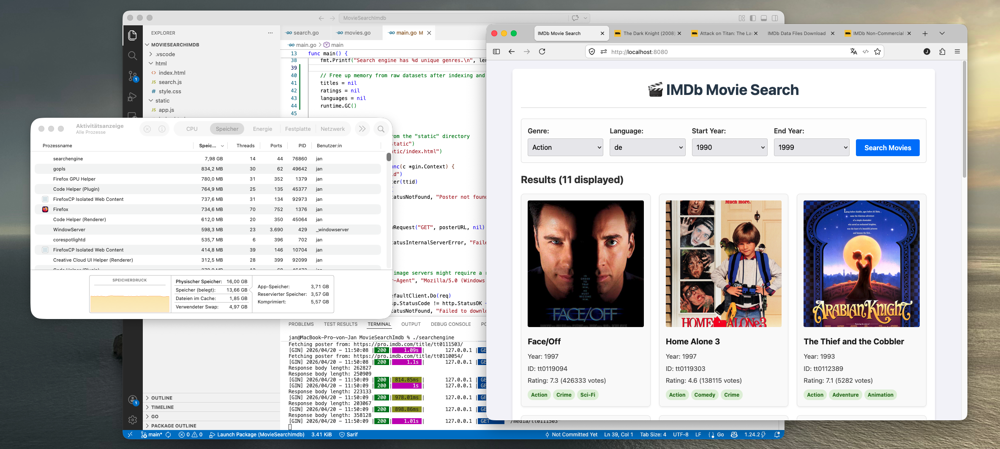

# IMDb Movie Search



A fast, in-memory search engine and web application that allows you to explore the IMDb dataset. The application automatically downloads the latest datasets on startup, indexes them in memory, and provides blazing-fast search capabilities with dynamic poster fetching.

## Features

- **Fast In-Memory Search:** Filters movies in milliseconds without needing an external database.
- **Filtering:** Search by **Genre**, **Language**, and **Start/End Year**.
- **Popularity Sorting:** Results are sorted by the number of votes (popularity) by default.
- **Dynamic Poster Fetching:** Real-time extraction of movie posters directly from IMDb through the `/media/:ttid` API.
- **Caching:** Built-in 30-day `Cache-Control` for downloaded images.
- **Optimized Memory Usage:** Discards raw dataset strings and proactively triggers Garbage Collection after indexing to keep a low RAM footprint.

## Data Sources (Auto-Downloaded)

The application automatically fetches and decompresses the following datasets from `datasets.imdbws.com` on startup:
- `title.basics.tsv.gz`: Title, Year, and Genres.
- `title.ratings.tsv.gz`: Average Ratings and Number of Votes.
- `title.akas.tsv.gz`: Regional Alternative Titles and Languages.

## Installation & Running

1. Ensure you have **Go** installed on your system.
2. Clone this repository and run the application:

```bash
go mod tidy
go run .
```

3. **Wait for Initialization:** The startup process will take a few moments as it downloads gigabytes of TSV files, parses them, indexes the `SearchEngine`, and then frees the raw string arrays.
4. **Open the Web UI:** Open `http://localhost:8080` in your web browser.

## Project Structure

- `main.go`: The HTTP server (using `gin-gonic`), startup scripts, and API routing.
- `movies.go`: Dataset downloader, TSV parser, and dynamic poster fetcher (`getPoster`).
- `search.go`: The core in-memory search engine supporting pagination, genre, year, and language indexing.
- `static/`: Contains the frontend web UI built with Vanilla JavaScript (`app.js`), HTML, and CSS.

